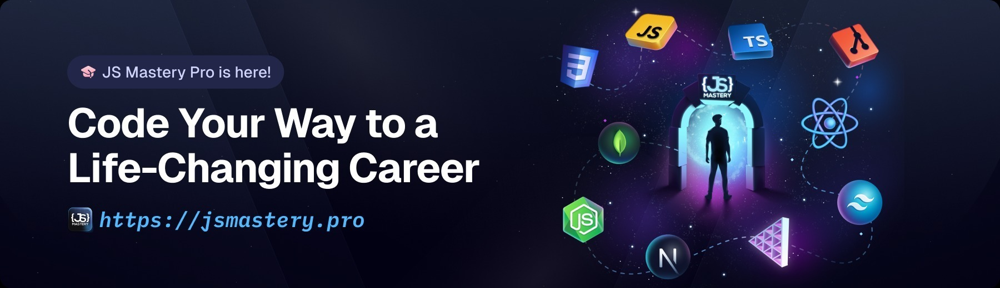

<div align="center">
  <br />
  
  <br />
  <div>
    
    
    
    
    
  </div>

  <h2 align="center">AI-Powered LMS SaaS Application</h2>
  <p align="center">
    A full-stack Learning Management System built with Next.js, Supabase, Stripe, and Clerk featuring AI Voice Tutors, real-time data, and a modern UI.
  </p>
</div>

---

## 📋 Table of Contents

1. 🤖 [Introduction](#introduction)
2. ⚙️ [Tech Stack](#tech-stack)
3. 🔋 [Features](#features)
4. 🤸 [Quick Start](#quick-start)
5. 🔗 [Assets](#assets)
6. 🚀 [More Info](#more-info)

---

## 🤖 Introduction

This project is a **SaaS Learning Management System (LMS)** designed for personalized, interactive learning.  
It features secure authentication, real-time data handling, subscription management, and **AI voice tutors** for dynamic learning sessions.  

Built with modern technologies like **Next.js**, **Supabase**, **Stripe**, and **Clerk**, this app demonstrates scalable full-stack architecture and clean, modular design.

---

## ⚙️ Tech Stack

### Frontend
- **Next.js** — Full-stack React framework (SSR, API routes)
- **TypeScript** — Type-safe development for large-scale apps
- **Tailwind CSS** — Utility-first CSS framework
- **shadcn/ui** — Accessible, modern component library

### Backend & Database
- **Supabase** — Open-source backend (PostgreSQL, Auth, Realtime)
- **Clerk** — Authentication and user management
- **Stripe** — Payments and subscription billing
- **Vapi** — AI-powered voice agent integration

### Tooling & Validation
- **Zod** — Schema validation
- **Sentry** — Error tracking and performance monitoring

---

## 🔋 Features

- 🎙 **AI Voice Tutors** — Talk with AI tutors in real time
- 🔐 **Authentication** — Secure sign-up/sign-in via Clerk (supports Google login)
- 💳 **Billing & Subscriptions** — Manage payments, upgrades, and plans with Stripe
- 🧠 **Bookmarks & Session History** — Track and revisit past lessons
- 🔍 **Search & Filters** — Quickly find tutors or topics
- 🧩 **Create Custom Tutors** — Choose subject, tone, and learning style
- ⚡ **Real-Time Data** — Powered by Supabase subscriptions
- 📱 **Responsive UI** — Works on mobile, tablet, and desktop
- 🧱 **Reusable Codebase** — Clean, modular, and scalable structure

---

## 🤸 Quick Start

Follow these steps to set up the project locally 👇  

### 1️⃣ Prerequisites
Make sure you have installed:
- [Git](https://git-scm.com/)
- [Node.js](https://nodejs.org/en)
- [npm](https://www.npmjs.com/)

---

### 2️⃣ Clone the Repository
```bash
git clone https://github.com/your-username/lms-saas-app.git
cd lms-saas-app


Enjoyed creating this project? Dive deeper into our PRO courses for a richer learning adventure. They're packed with
detailed explanations, cool features, and exercises to boost your skills. Give it a go!

<a href="https://jsm.dev/converso-nextjs" target="_blank">
  
</a>
